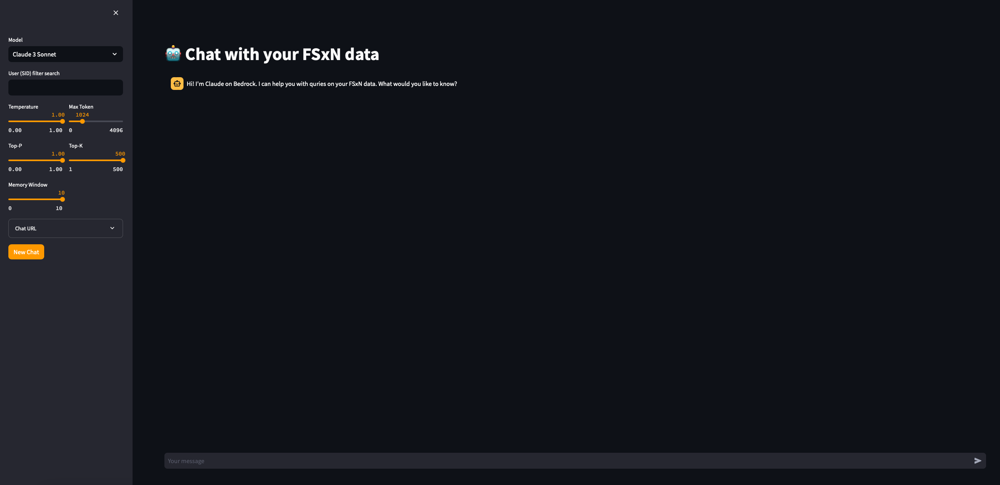

# Chatbot Application
## Overview
This is a chatbot client built using [streamlit](https://streamlit.io). It interacts with the RAG lambda functions and displays inputs and outputs in a chat like interface.  


## Input
This is how the chat window looks like:


### Chat Input
* **Your message**: user prompt/question for the model

### Sidebar Properties:
You can setup most input parameters on the side bar to the left:
* **Model**: AWS Bedrock Model for inferencing. Current supported models are ``Anthropic Claude v2`` and ``Anthropic Claude 3 Sonnet``.
* **User (SID) Filter Search (str)**: User SID to filter the data we access too based on original ACL SID access auth. 
* **Model Arguments**: list of paramers for the foundation model
    * **Temperature**: The amount of randomness injected into the response. Ranges from 0 to 1. Use temp closer to 0 for analytical / multiple choice, and closer to 1 for creative and generative tasks.
    * **Top P**: Use nucleus sampling. In nucleus sampling, Anthropic Claude computes the cumulative distribution over all the options for each subsequent token in decreasing probability order and cuts it off once it reaches a particular probability specified by top_p. You should alter either ``temperature`` or ``top_p``, but not both.
   * **Top K**: Only sample from the top K options for each subsequent token. Use ``top_k`` to remove long tail low probability responses
   * **Max_Tokens**: The maximum number of tokens to generate before stopping.
* **Memory Window**: Only keep last K interaction in the memory of the chat.
* **Chat URL**: path to the RAG lambda function API access.

### ENV Variable Inputs
* **CHAT_URL**: path to the RAG lambda function API access.

## Testing
#### Pre-requsites:
* Docker engine

#### Build:
Use the following to build the app:
```
docker build -t <image name> --platform linux/amd64 .
```

#### Run
Use the following to run the app:
```
docker run -d -p 8501:8501 -e CHAT_URL='<-lambda-api-gtw-url>' <docker-image> 
```


